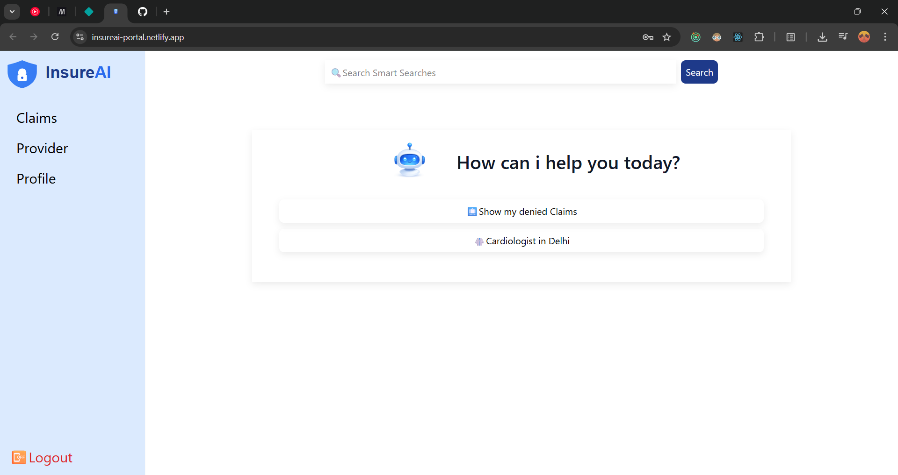
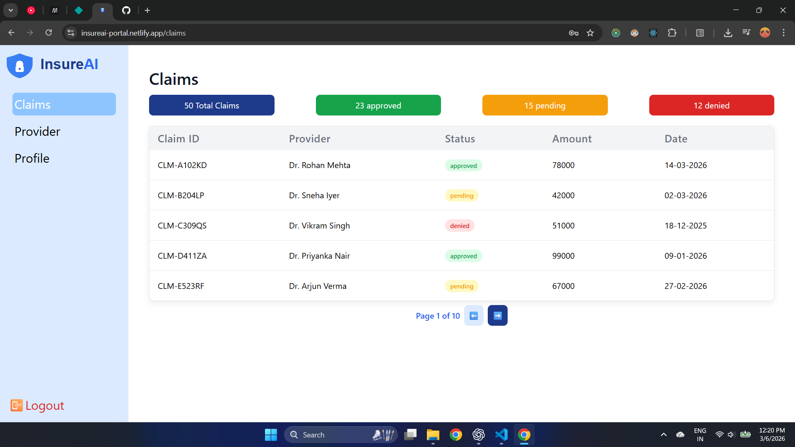
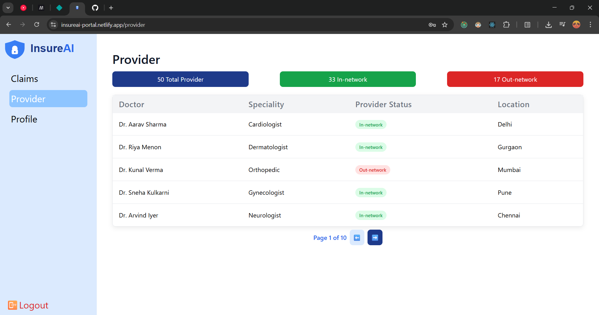
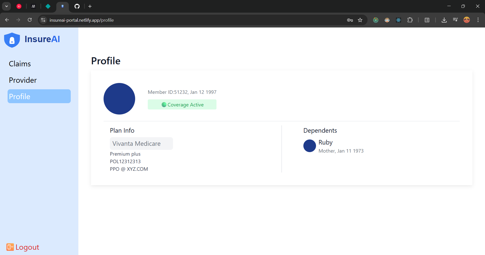
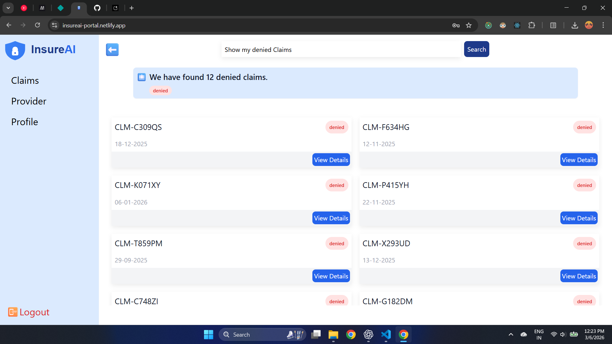

# 🛡️ InsureAI – AI Powered Insurance Portal


> An intelligent insurance dashboard that uses **AI-powered natural language search** to help users find providers and claims instantly.

🌐 **Live Demo**
[https://insureai-portal.netlify.app](https://insureai-portal.netlify.app)

---

## 📌 Quick Links

- [Project Updates](#project-updates)

---

# 🚀 Overview

**InsureAI** is a modern frontend application that allows users to interact with their insurance data using **natural language queries**.

Instead of navigating through complex filters, users can simply ask:

```
Show cardiologists in Delhi
Show approved claims
Doctors in Pune
Find In-network providers
```

The system uses **OPEN AI** to convert user queries into structured intent data, which is then used to fetch relevant claims or providers.

This project demonstrates **AI integration with frontend architecture**, clean state management, and robust error handling.

---

# ✨ Key Features

### 🤖 AI Smart Search

Natural language queries are processed using **OPEN AI** to extract structured intent.

Example:

User Query

```
Show In-network cardiologists in Delhi
```

AI Response

```json
{
  "intent": "get_providers",
  "filters": {
    "speciality": "cardiologist",
    "location": "Delhi",
    "providerStatus": "In-network"
  },
  "limit": null
}
```

The app then fetches the filtered results automatically.

---

### 🔐 Authentication System

Implemented using **Firebase Authentication**

Features:

- Secure user signup
- Login authentication
- Protected routes
- Error handling for invalid credentials
- Form validation

---

### 🧾 Claims Management

Users can:

- View claims dashboard
- Filter claims via AI search
- See claim status
  - Approved
  - Pending
  - Denied

- View claim details

Example AI query:

```
Show my denied claims
Show recent approved claims
```

---

### 🏥 Provider Search

Users can search for healthcare providers using AI.

Example queries:

```
Cardiologists in Delhi
Dermatologists in Mumbai
Doctors in Pune
In network doctors near Hyderabad
```

Provider data includes:

- Doctor name
- Specialty
- Location
- Network status

---

### ⚡ Smart UI States

The application handles multiple UI states to ensure smooth UX:

- Loading Shimmers
- No Data Found
- AI Unknown Intent
- API Failure
- Empty Results

This prevents blank screens and improves user experience.

---

# 🧠 AI Query Processing Flow

```
User Query
   ↓
Netlify Serverless Function
   ↓
OpenAI API (intent extraction)
   ↓
Structured JSON (intent + filters)
   ↓
Service Layer (business logic)
   ↓
Mock API / Data Filtering
   ↓
UI Rendering
```

This architecture allows natural language queries to be translated into structured API requests.

---

# 🏗️ Project Architecture

The project follows a **clean separation of concerns** between UI, business logic, and API services.

```
└── netlify
     └── functions
           └── claims-provider.js (serveless function)
src
│
├── assets
├── constants
├── module
│   └── ...see repo
│
├── page
│   ├── DashboardPage.jsx
│   ├── ClaimsPage.jsx
│   ├── ProviderPage.jsx
│   └── AuthPage.jsx
│   └── ...see repo
│
├── ui
│   ├── DashboardUI.jsx
│   ├── ClaimsUI.jsx
│   ├── ProviderUI.jsx
│   └── AuthUI.jsx
│   └── ...see repo
│
│
├── service
│   ├── aiService.js
│   ├── claimsService.js
│   ├── providerService.js
│   └── firebaseApi.js
│   └── ...see repo
├── router
├   └── ...see repo
├── store
│
└── utility
│    └── validate.js
└── root.jsx
└── bootstrap.jsx
└── index.css
```

---

# 🛠 Tech Stack

### Frontend

- React
- Vite
- TailwindCSS
- React Router

### AI

- OpenAI API

### Authentication

- Firebase Authentication

### Data

- MockAPI.io (REST endpoints)

### Deployment

- Netlify

---

# ⚙️ Installation

Clone the repository

```
git clone https://github.com/your-username/insureai-portal.git
```

Navigate to the project

```
cd insureai-portal
```

Install dependencies

```
npm install
```

Run the development server

```
npm run dev → runs frontend only (no functions)
npx netlify dev → runs frontend + serverless functions
```

---

# 🔑 Environment Variables

Create a `.env` file:

```
OPENAI_API_KEY=your_openai_api_key
```

---

# 📸 Screenshots

### Authentication

Secure login and signup with Firebase.


---

### AI Smart Search

Search providers and claims using natural language.


---

### Claims Dashboard

View insurance claims.


---

### Provider Dashboard

View providers.


---

### Profile Dashboard

View providers.


---

### Provider/ Claims AI Search

Find doctors by location, speciality, and network status or show my denied claims, my last 3 approved claims



---

# 📈 What This Project Demonstrates

This project showcases practical skills in:

- AI Integration with Frontend
- API Architecture
- React State Management
- Error Handling
- UX Handling for Async Data
- Authentication Systems
- Deployment & Production Build

---

# 📄 License

This project is built for **learning and portfolio purposes**.

---

## Project Updates

### Config-Driven UI

- Converted UI behavior and labels into config-based JS objects
- Enabled scalable and maintainable UI by reducing hardcoded logic
- Improved flexibility for extending features without modifying core components

### Custom Hooks

- Introduced `usePagination` to handle pagination logic (total pages, slicing indices)
- Created `useFilteredData` to manage status-based filtering
- Improved separation of concerns by moving business logic out of UI components
- Optimized computations using `useMemo`

### Dynamic Filtering

- Implemented status-based filtering (e.g., Total, Approved, Pending)
- UI interactions update `activeStatus`, triggering real-time data filtering
- Ensures state-driven rendering and cleaner component structure

---

💡 Built to demonstrate **AI integration in modern frontend applications using React**.

---
